

フラクタルと微積分
===
##### March 19 2026
###### @ryqjufq0xfffrog

---
# 目次

1. フラクタルと微積分は相性が悪い!
2. 分数次元
    2.1. 体積の測り方
    2.2. 体積の性質
    2.3. フラクタル図形の次元
3. 分数階微積分
    3.1. 整数次の累次積分
    3.2. 整数次の累次積分の図形的意味
    3.3. 分数階積分

---

# 1. フラクタルと微積分は相性が悪い!

今回の発表では、分数次元におけるフラクタルと微積分のつながりから
「フラクタルと微積分が互いの問題の解決に有用である」ことを説明するが、

その前に、この2つの相性が悪いと一般的に言われている理由についても解説する。

---

## そもそもフラクタルとは?

フラクタル図形とは、その一部を拡大しても、元の図形と同じくらい複雑な図形のこと。
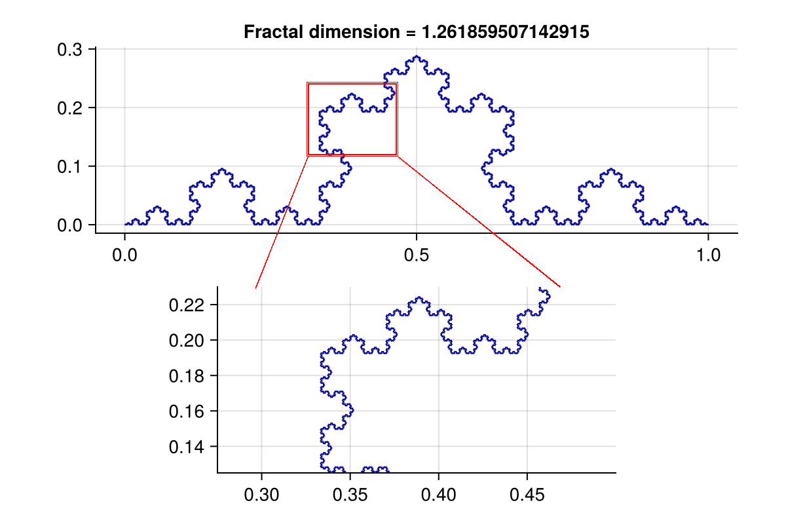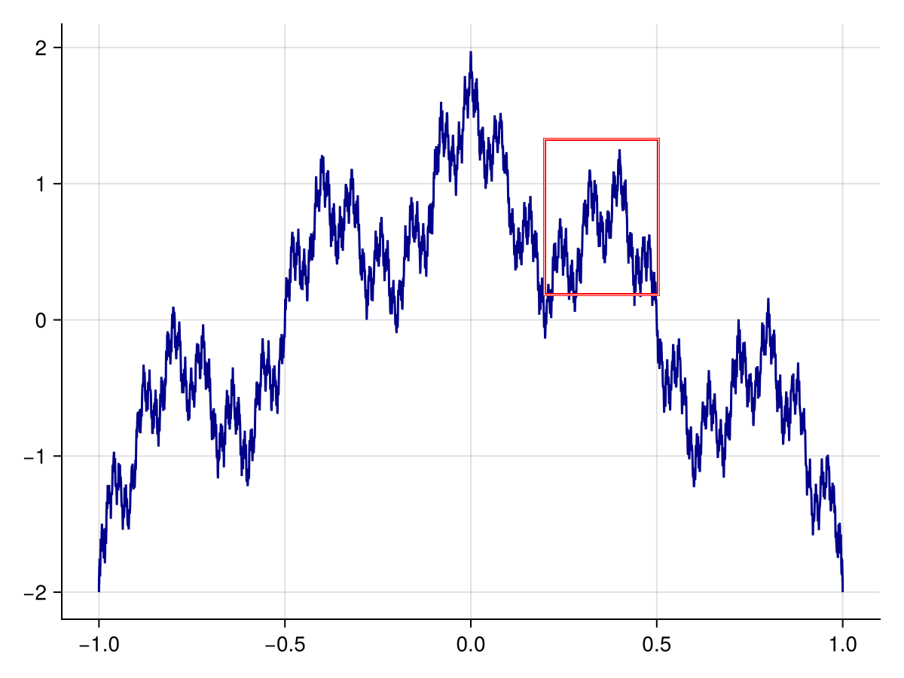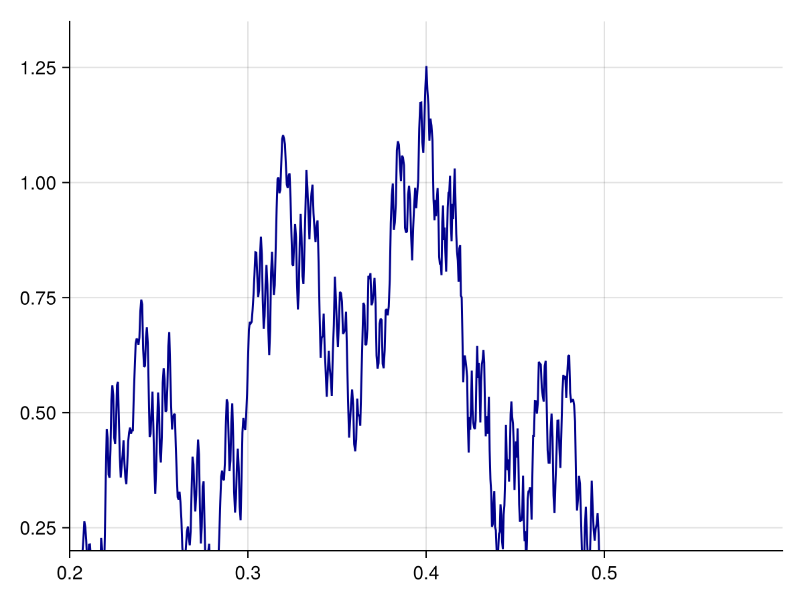

### 相性の悪さ

接線(= 微係数)が至るところで存在しない連続な曲線の例 : コッホ曲線、Weierstrass関数
$\to$ そのような曲線はどれも「フラクタル」となり、逆に、複雑なフラクタル図形は微係数を持たない。これが相性の悪さの例となる。

---

# 2. 分数次元

フラクタル図形の次元は、整数でないことがある。
そして、分数次元図形の体積を求めることは一般に非常に難しい。

---

## 2.1. 体積の測り方 (非フラクタル図形用)

| | **1次元** | $\dots$ | **2次元** | $\dots$ | **3次元** |
| :-- | :--: | :--: | :---: | :--: | :---: |
| |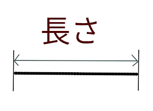| $\dots$ |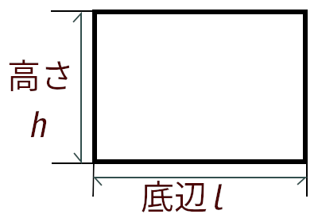| $\dots$ |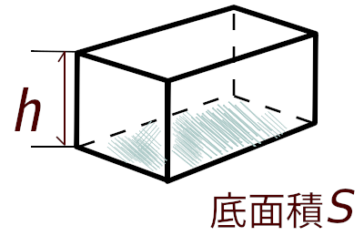|
| **名称** | 長さ | $\dots$ | 面積 | $\dots$ | 体積 |
| **柱の体積** | $l$ | $\dots$ | $S=l \times h$ | $\dots$ | $V=S \times h$ |
| **H測度** | 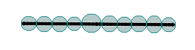 $\inf\left\{\sum_{k}^{\infty} (\text{直径}_k)^1\right\}$ | $\dots$ | 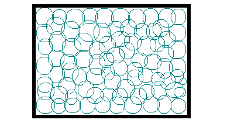 $\inf\left\{\sum_{k}^{\infty} (\text{直径}_k)^2\right\}$ | $\dots$ | 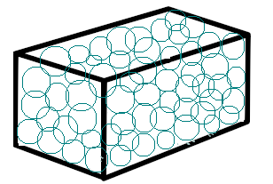 $\inf\left\{\sum_{k}^{\infty} (\text{直径}_k)^3\right\}$ |

\* いわゆる体積である「Lebesgue測度」と「Hausdorff測度」は、互いに定数倍の関係。

---

## 2.1. 体積の測り方 ― 図形の次元と測度の次元が一致しないとき

ある図形の次元を$D$として、
> - $D$より高い次元の測度で測ると、体積は$0$になる。
> - $D$次元の測度で測ると、「正しい」体積の値を得る。
> - $D$より低い次元の測度で測ると、体積は$\infty$になる。

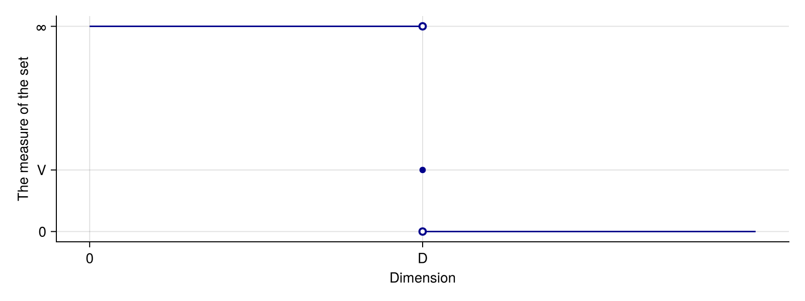

---

## 2.1. 体積の測り方 ― 具体例

単位円は2次元の図形だが、2次元以外の測度でも体積を測ることができる。
| | **1次元** | **2次元** | **3次元** |
| :-- | :--: | :--: | :--: |
| |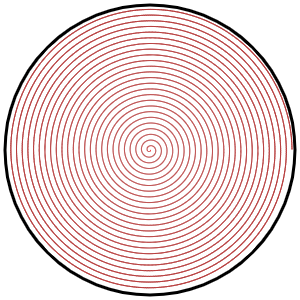||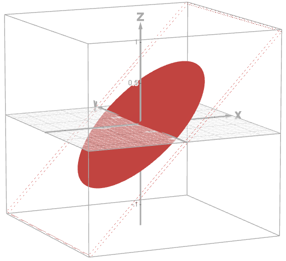|
| **体積** | 長さ : $\infty$ | 面積 : $\pi \times 1^2 = \pi$ | 体積 : $\pi \times 0 = 0$ |

---

## 2.2. 体積の性質

相似な図形同士の体積比は、その図形の次元を$D$として、$\text{相似比}^D$となる。
 $\because)\inf\left\{\sum_{k}^{\infty} (\text{相似比}\times\text{直径}_k)^D\right\} = \text{相似比}^D\times\inf\left\{\sum_{k}^{\infty} (\text{直径}_k)^D\right\}$ (Hausdorff測度)
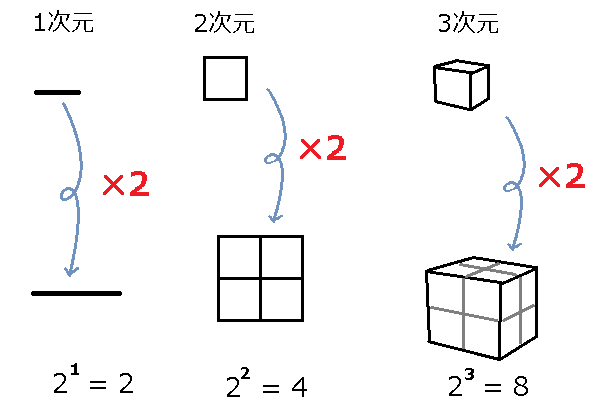 $\gets$ 相似比2倍

---

## 2.3. フラクタル図形の次元

例えば、Koch曲線に関しては、

各色について、曲線全体との相似比が3倍、4つで全体の体積になるので体積比は4倍。
$$\begin{align}\therefore &3^D = 4 \\
\text{両辺}\log\text{をとって、}&D\log3 =\log 4 \\
&D = \frac{\log4}{\log3} \risingdotseq 1.26 \end{align}$$

しかし、分数次元図形としての体積(Hausdorff測度)は求まっていない。**(未解決問題)**

---

# 3. 分数階微積分

定積分を繰り返し行う操作を、累次積分という。
累次積分の回数は非整数回に拡張でき、これを「分数階積分」という。
ここから定義される「分数階」の微積分を用いると、
ある種の分数次元図形の体積を解析的に求めることができる。

---

## 3.1. 整数階微積分

$n$回、定積分を$f(x)$に適用した関数を$f^{(-n)}(x)$と書く。
定義は、
$$f^{(0)}(x) := f(x), f^{(-(n + 1))}(x) := \int_b^x f(t)\,\mathrm{d}t$$

Cauchyの累次積分に関する公式 **[1]** :
$$f^{(-n)}(x) = \int_b^x\frac{\left(x-t\right)^{n-1}}{(n-1)!} f(t)\,\mathrm{d}t \quad (n > 0)$$

この公式は部分積分と数学的帰納法を用いて証明される。
$\to$ ここではこの公式の図形的な意味について解説する。

---

## 3.2. 累次積分の図形的な意味

<video src="../img/1stintegration.mp4" controls></video>

---

## 3.2. 累次積分の図形的な意味

<video src="../img/2ndintegration.mp4" controls></video>

---

## 3.2. 累次積分の図形的な意味

<video src="../img/2ndintegration2.mp4" controls></video>

---

## 3.2. 累次積分の図形的な意味

| **累次積分** | **1回目** | **2回目** | **3回目** |
| :-- | :--: | :--: | :--: |
| $t$での断面 |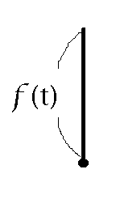|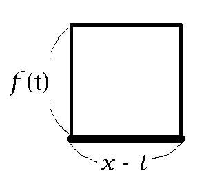|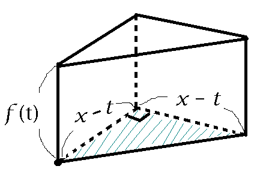|
| **底面** | 0次元 (点) | 1次元 (線分) | 2次元 (直角二等辺三角形) |
| **底面の測度** | $1$ | $(x-t)$ | $\frac{1}{2}(x-t)^2$ |
$$f^{(-n)}(x) = \int_b^x\boxed{\frac{\left(x-t\right)^{n-1}}{(n-1)!}} f(t)\,\mathrm{d}t \quad (n > 0)$$

---

## 3.3. 分数階積分の図形的意味

ならば、$t$での断面が分数次元図形になるような立体を使えば、
その立体の測度(の定数倍)は分数階積分の値となる。$\to$ 測度を解析的に計算できる!

  

    <video src="../img/3dfractal_animation.mp4" controls></video>
  

  

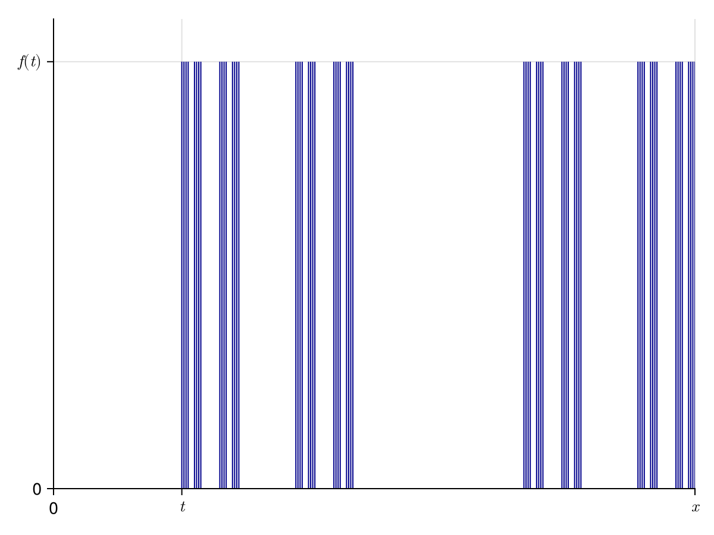

  

---

参考文献

**[1]** Wikipedia contributors. (2026, February 15). *Cauchy formula for repeated integration*. In Wikipedia, The Free Encyclopedia. Retrieved 09:07, March 8, 2026, from https://en.wikipedia.org/w/index.php?title=Cauchy_formula_for_repeated_integration&oldid=1338500896

Wikipedia contributors. (2026, March 5). *Hausdorff measure*. In Wikipedia, The Free Encyclopedia. Retrieved 09:06, March 8, 2026, from https://en.wikipedia.org/w/index.php?title=Hausdorff_measure&oldid=1341869850

**グラフ類** : Simon Danisch, & Julius Krumbiegel (2021). *Makie.jl: Flexible high-performance data visualization for Julia*. *Journal of Open Source Software, 6(65), 3349*.

---

## 補遺 : 3.3. 分数階積分の図形的意味

さきのグラフは2つの意味で不正確である :

  

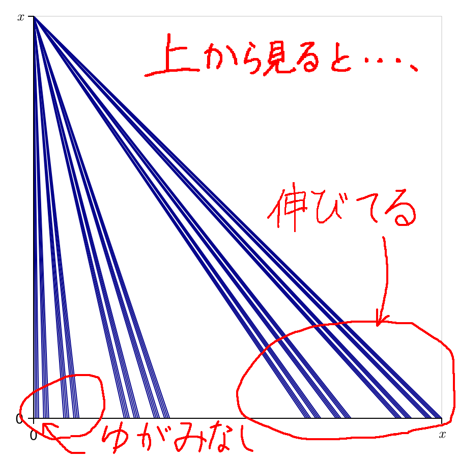

  

  

この立体の断面は3進集合と線分の直積である。
円柱で被覆して測る測度(以下、円柱測度と呼ぶ)が、
Hausdorff測度の定数倍になっているか分からない。
ただし、測る対象が理想的な場合、可測な集合$A$に対し、D次元の円柱測度 $\text{⛁}^D(A)$ は、
$$\text{⛁}^D(A) = \frac{\Gamma(\frac{D+1}{2})}{\Gamma(\frac{D}{2}+1)}\left(\frac{\sqrt{\pi}}{2}\right)\mathcal{H}^D(A)$$
を満たす。

  

---

参考文献 (補遺)

Prof. Kai Seng CHOU. (2014/15). *Lebesgue and Hausdorff Measures*. https://www.math.cuhk.edu.hk/course_builder/1415/math5011/MATH5011_Chapter_3.2014.pdf

Jimmy Briggs and Tim Tyree. (December 3, 2016). *Hausdorff Measure*. https://sites.math.washington.edu/~farbod/teaching/cornell/math6210pdf/math6210Hausdorff.pdf

Losonczi, A. (2024, January 21). *The Hausdorff-integral and its applications*. arXiv.org. https://arxiv.org/abs/2401.11465v1
